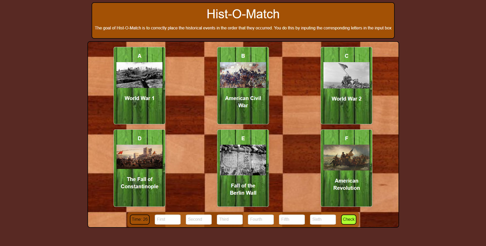
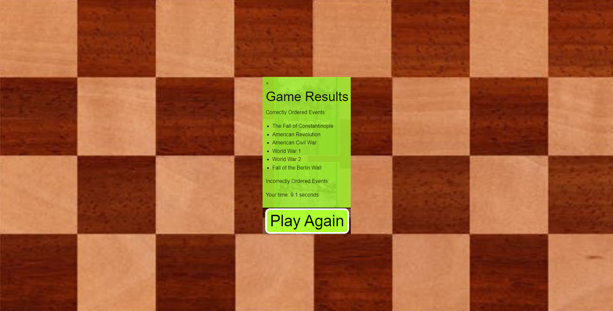
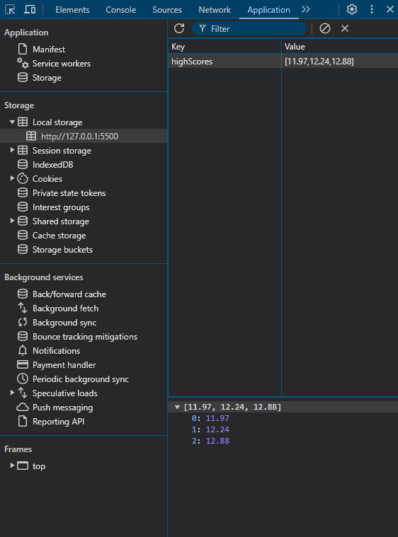

# Hist-O-Match
## History Matching Game
 Looking at the six cards on the screen, the player must type the cards' corresponding letters into the input boxes at the bottom of the page. Enter the cards in the order that the events occured thoughout history!
 These topics can vary from US History to World History, be sure that you have your thinking cap on!

 

 ## Results
When you press the 'check' button after entering your answers, you will be shown what answers you got correct and/or incorrect. You can repeat the game until you have the order logged correctly. When everything is right, the actual dates of the events will show up on the cards. If you'd like to play again, hit the "Play Again" button

## High Scores
If you would like to see your High Score, inspect your webpage and head over to Application. Here it will show you your top 3 scores!

## License
MIT License

## Credits
Created and published by Andrew Angus, Dario Zambrano, and Grace Kirk

## Contact Information
Check us out on Github!
 
 * Andrew:  https://github.com/aangus98 
 * Dario: https://github.com/DarioJZB
 * Grace: https://github.com/Graceatkirk

